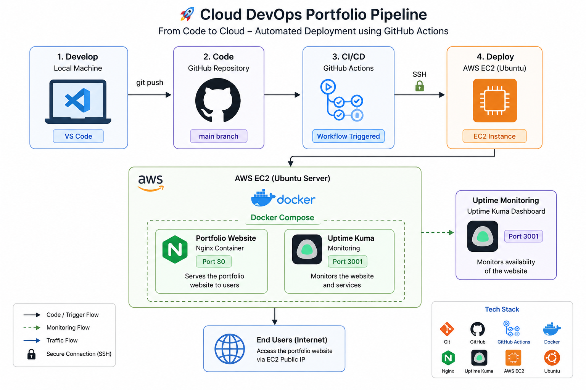

# 🚀 Cloud DevOps Portfolio Pipeline


## Architecture

This project follows a simple CI/CD pipeline where every push to the `main` branch automatically deploys the latest version of the application to an AWS EC2 instance using GitHub Actions and Docker.



A hands-on Cloud & DevOps project where I built a simple portfolio website and deployed it to AWS using Docker and GitHub Actions.

Instead of only learning concepts, I wanted to build something practical that covers the complete deployment workflow—from writing code locally to automatically deploying it to a cloud server.

---

## Project Overview

This project demonstrates a basic CI/CD pipeline using GitHub Actions.

Whenever I push changes to the `main` branch:

- GitHub Actions automatically starts
- Connects securely to my AWS EC2 instance using SSH
- Pulls the latest code
- Rebuilds the Docker containers
- Deploys the updated website automatically

No manual deployment is required after `git push`.

---

## Tech Stack

- HTML
- CSS
- JavaScript
- Git
- GitHub
- GitHub Actions
- Docker
- Docker Compose
- Nginx
- AWS EC2
- Ubuntu Linux

---

## Features

- Responsive portfolio website
- Dockerized application
- Multi-container setup using Docker Compose
- Automated deployment with GitHub Actions
- Hosted on AWS EC2
- Uptime Kuma monitoring

---

## Project Structure

```
linux-devops-pipeline/
│
├── app/
│   ├── index.html
│   ├── style.css
│   └── script.js
│
├── .github/
│   └── workflows/
│       └── deploy.yml
│
├── Dockerfile
├── docker-compose.yml
└── README.md
```

---

## Deployment Workflow

```
VS Code
    │
git push
    │
GitHub Repository
    │
GitHub Actions
    │
SSH
    │
AWS EC2
    │
Docker Compose
    │
Portfolio Website
```

---

## What I Learned

Through this project I gained practical experience with:

- Linux command line
- Git and GitHub workflow
- Docker images and containers
- Docker Compose
- Nginx
- AWS EC2
- SSH authentication
- GitHub Secrets
- GitHub Actions
- CI/CD pipelines

I also learned how to troubleshoot deployment issues such as SSH authentication, security group configuration, GitHub Actions debugging, and cloud networking.

---

## Future Improvements

This project will continue to grow as I learn more Cloud and DevOps technologies.

Planned improvements include:

- Terraform
- Kubernetes
- HTTPS with Let's Encrypt
- Custom domain
- Docker Hub
- Monitoring with Prometheus & Grafana

---

## Author

**Amanbir Singh**

B.Tech Information Technology Student

Currently learning Cloud Computing and DevOps through hands-on projects.